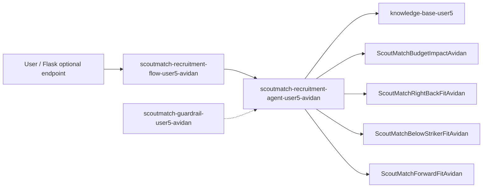

# ScoutMatch Recruitment Extension Architecture

## Principles

- v14 Flask RAG (`/api/sessions/.../messages`) is unchanged.
- Legacy demo resources are never modified.
- Lambdas use only baseline document rules (no invented facts).
- Deploy is idempotent; default mode is `--plan`.
