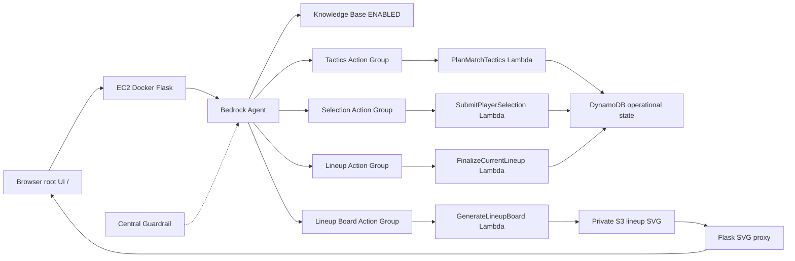

# ScoutMatch Agent Extension Architecture (final)

## Primary user

**Scout / Professional Analyst** preparing opening-season recruitment and lineup recommendations.

## Final runtime flow

## Four public Agent-facing tools

| Tool | Lambda |
|------|--------|
| `PlanMatchTactics` | `ScoutMatchPlanMatchTacticsAvidan` |
| `SubmitPlayerSelectionToManagement` | `ScoutMatchSubmitPlayerSelectionAvidan` |
| `FinalizeCurrentLineup` | `ScoutMatchFinalizeCurrentLineupAvidan` |
| `GenerateCurrentLineupBoard` | `ScoutMatchGenerateLineupBoardAvidan` |

## Principles

- v14 Flask RAG (`/api/sessions/.../messages`) remains available.
- Root UI at `/` is the primary presentation route; `/recruitment-advisor` is diagnostic only.
- Write actions require explicit Confirm; DynamoDB is the source of truth for recommendations.
- SNS is optional and non-blocking.
- Legacy helper Lambdas (budget fit, shortlist, native router) are detached from the public Agent and preserved for rollback only.
- Local deploy state lives in `infra/scoutmatch_agent_extension/.local/` (never commit or package).
